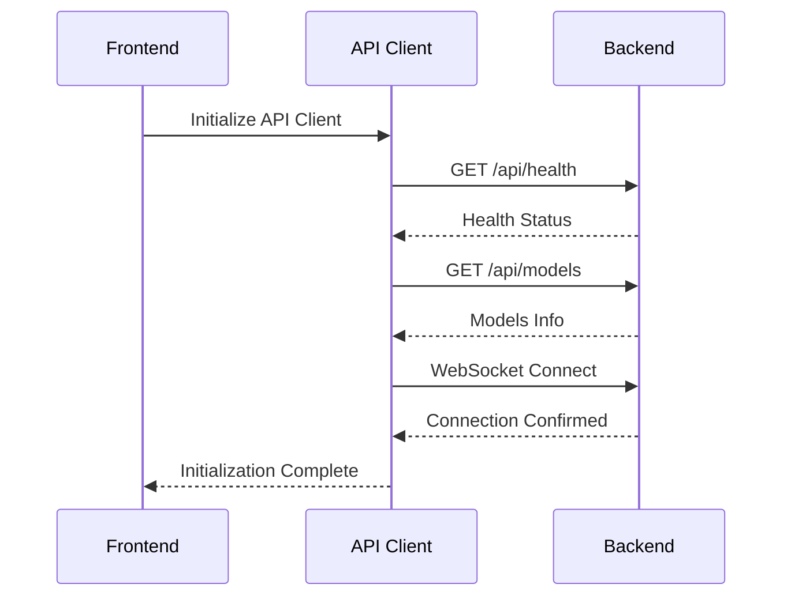
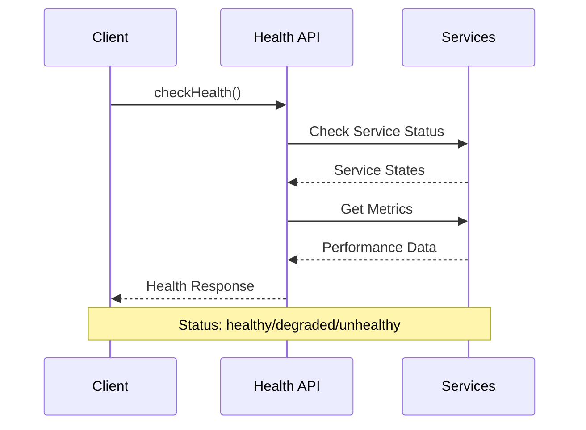
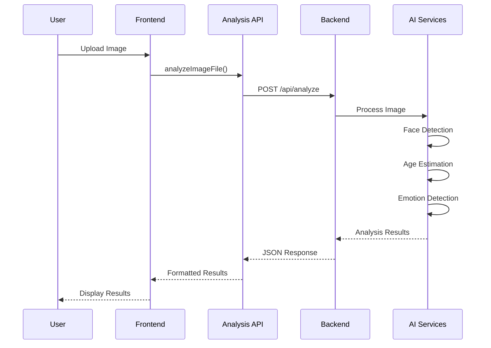
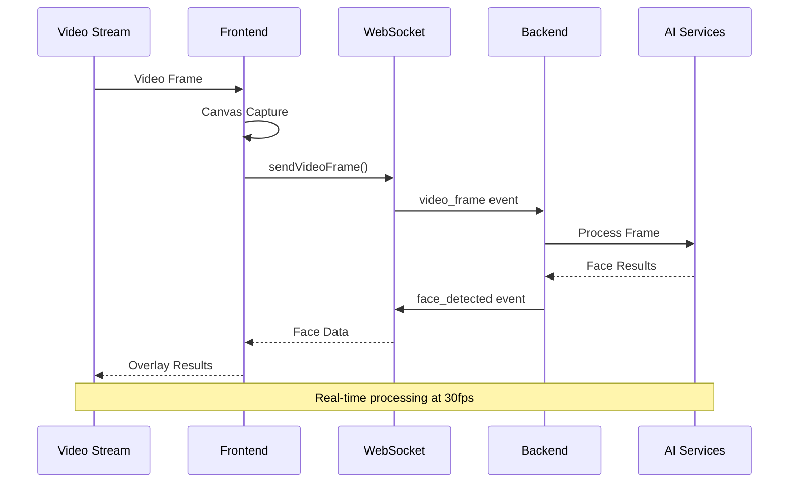
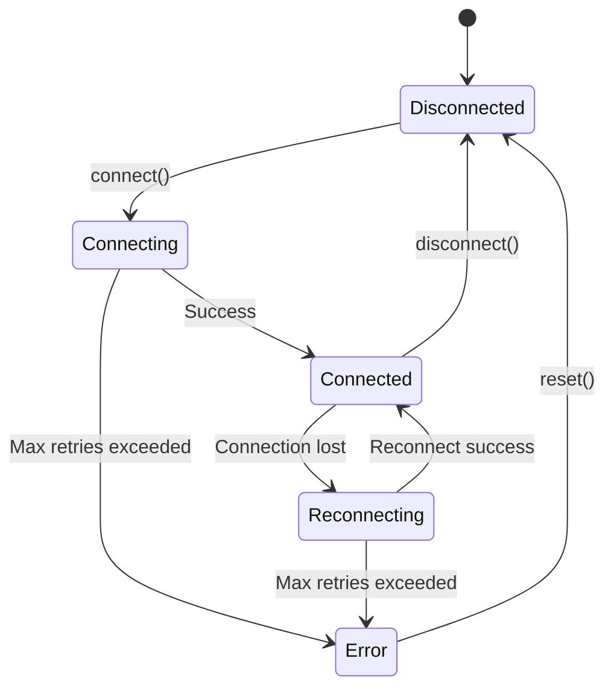
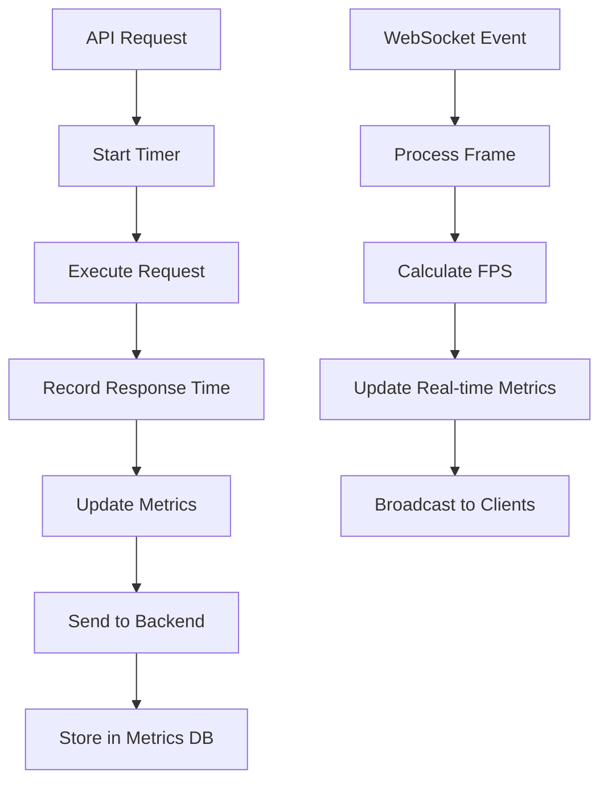

# IRIS Facial Analysis Platform - Connection Flow Documentation

## System Architecture Overview

```
┌─────────────────┐    HTTP/WebSocket    ┌─────────────────┐
│                 │ ◄─────────────────► │                 │
│   Frontend      │                     │    Backend      │
│  (Next.js)      │                     │   (Flask)       │
│  Port: 3000     │                     │  Port: 5001     │
│                 │                     │                 │
└─────────────────┘                     └─────────────────┘
         │                                       │
         │                                       │
         ▼                                       ▼
┌─────────────────┐                     ┌─────────────────┐
│   API Client    │                     │   AI Services   │
│   - Health      │                     │   - Face Det.   │
│   - Models      │                     │   - Age Est.    │
│   - Analysis    │                     │   - Emotion     │
│   - Upload      │                     │   - Video Proc. │
│   - WebSocket   │                     │                 │
└─────────────────┘                     └─────────────────┘
```

## Connection Initialization Flow

### 1. Frontend Startup


### 2. Health Check Sequence


### 3. Image Analysis Flow


### 4. Real-time WebSocket Flow


## API Client Architecture

### Frontend API Structure
```
frontend/lib/api/
├── index.ts           # Main API client & exports
├── types.ts           # TypeScript interfaces
├── config.ts          # Configuration management
├── base.ts            # Base client with retry logic
├── healthApi.ts       # Health monitoring
├── modelsApi.ts       # AI model management
├── analysisApi.ts     # Image/video analysis
├── uploadApi.ts       # File upload/management
└── websocketApi.ts    # Real-time communication
```

### Backend Route Structure
```
backend/routes/
├── __init__.py        # Route exports
├── health.py          # Health & system status
├── models.py          # AI model information
├── analysis.py        # Image analysis endpoints
└── upload.py          # File upload/management
```

## Connection States & Error Handling

### Connection States
1. **Disconnected** - No connection to backend
2. **Connecting** - Attempting to establish connection
3. **Connected** - Successfully connected
4. **Reconnecting** - Attempting to reconnect after failure
5. **Error** - Connection failed permanently

### Error Recovery Flow


### Retry Logic
- **HTTP Requests**: 3 attempts with exponential backoff (1s, 2s, 4s)
- **WebSocket**: 5 reconnection attempts with 1s delay
- **File Upload**: Single attempt with progress tracking

## Performance Monitoring

### Metrics Collection


### Key Performance Indicators
- **Response Time**: Average API response time
- **Success Rate**: Percentage of successful requests
- **Frame Rate**: Real-time analysis FPS
- **Connection Stability**: WebSocket uptime percentage
- **Error Rate**: Failed requests per minute

## Security Considerations

### Current Implementation
- **No Authentication**: All endpoints are publicly accessible
- **CORS Enabled**: Configured for localhost:3000
- **File Validation**: Type and size restrictions
- **Input Sanitization**: Base64 validation for images

### Recommended Enhancements
1. **API Key Authentication**: Implement API key validation
2. **Rate Limiting**: Add request throttling per client
3. **Input Validation**: Enhanced file type verification
4. **HTTPS**: Use secure connections in production
5. **Content Security Policy**: Implement CSP headers

## Deployment Configuration

### Development Environment
```yaml
Frontend:
  URL: http://localhost:3000
  API_URL: http://127.0.0.1:5001

Backend:
  URL: http://127.0.0.1:5001
  CORS_ORIGINS: ["http://localhost:3000"]
  DEBUG: true
```

### Production Environment
```yaml
Frontend:
  URL: https://iris-analysis.com
  API_URL: https://api.iris-analysis.com

Backend:
  URL: https://api.iris-analysis.com
  CORS_ORIGINS: ["https://iris-analysis.com"]
  DEBUG: false
```

## Testing & Validation

### Connection Tests
1. **Health Check**: Verify all services are running
2. **Model Loading**: Confirm AI models are loaded
3. **WebSocket**: Test real-time communication
4. **File Upload**: Validate upload functionality
5. **Analysis**: Test image processing pipeline

### Automated Testing Script
```bash
#!/bin/bash
echo "Testing IRIS API Connection..."

# Health check
curl -f http://127.0.0.1:5001/api/health || exit 1

# Models check
curl -f http://127.0.0.1:5001/api/models || exit 1

# WebSocket test
node test_websocket_connection.js || exit 1

echo "All tests passed!"
```

## Troubleshooting Guide

### Common Issues

#### Backend Not Responding
```bash
# Check if backend is running
ps aux | grep python | grep app.py

# Check port availability
lsof -i :5001

# Restart backend
cd backend && source cv_venv/bin/activate && python app.py
```

#### CORS Errors
- Verify frontend URL in backend CORS configuration
- Check browser developer tools for specific CORS errors
- Ensure backend is running on correct port

#### WebSocket Connection Failures
- Check network connectivity
- Verify WebSocket URL configuration
- Monitor browser console for connection errors
- Test with WebSocket debugging tools

#### Analysis Failures
- Verify AI models are loaded (`/api/models`)
- Check image format and size
- Monitor backend logs for processing errors
- Test with known good images

### Debug Commands
```bash
# Backend logs
tail -f backend/logs/app.log

# Frontend development server
npm run dev

# API testing
curl -v http://127.0.0.1:5001/api/health

# WebSocket testing
node test_websocket_connection.js
```

## Future Enhancements

### Planned Features
1. **Authentication System**: JWT-based authentication
2. **User Management**: User accounts and preferences
3. **Analytics Dashboard**: Real-time metrics visualization
4. **Batch Processing**: Queue-based batch analysis
5. **Model Versioning**: Support for multiple model versions
6. **Caching Layer**: Redis-based response caching
7. **Load Balancing**: Multiple backend instances
8. **Database Integration**: Persistent storage for results

### API Versioning Strategy
- **v1**: Current implementation
- **v2**: Authentication + enhanced features
- **v3**: Advanced analytics + ML improvements

The connection flow is designed to be robust, scalable, and maintainable, providing a solid foundation for the IRIS Facial Analysis Platform.
